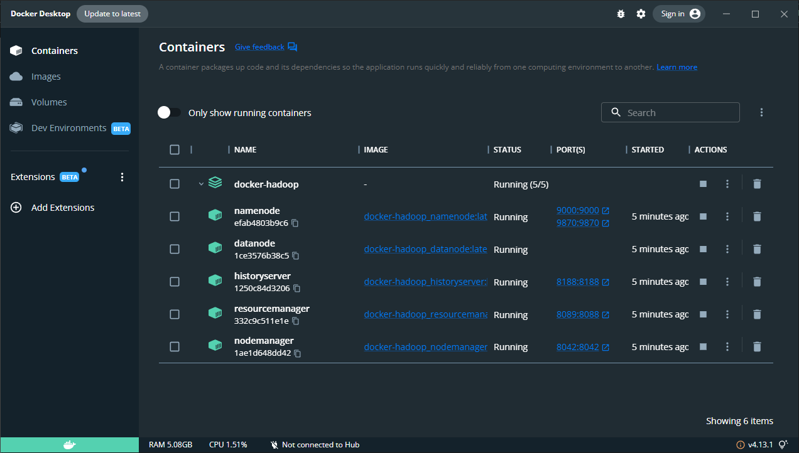
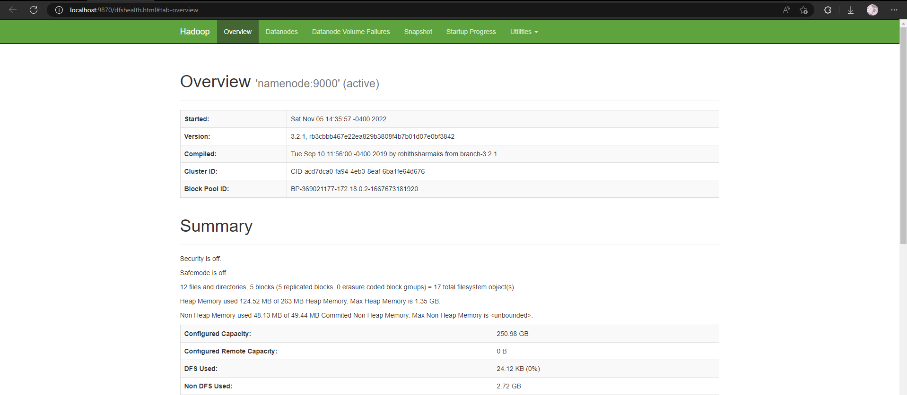

## Installation

In order to ensure portability, this project uses docker to run hadoop and python based MapReduce.

You need to install 
- Docker and Docker Compose (On Windows Machine, **WSL2 is required**)
- Git

## Running the project

1. Clone this repo
2. Run the docker containers for docker
```bash
  > cd docker-hadoop
  > docker-compose up -d
```

3. After building the containers, use the following command to verify all the containers are up and running
```bash
  > docker ps
```

You should be able to see the following running containers
```
CONTAINER ID   IMAGE                           COMMAND                  CREATED              STATUS                        PORTS                                            NAMES
1250c84d3206   docker-hadoop_historyserver     "/entrypoint.sh /run…"   About a minute ago   Up About a minute (healthy)   0.0.0.0:8188->8188/tcp                           historyserver
332c9c511e1e   docker-hadoop_resourcemanager   "/entrypoint.sh /run…"   About a minute ago   Up About a minute (healthy)   0.0.0.0:8089->8088/tcp                           resourcemanager
1ae1d648dd42   docker-hadoop_nodemanager       "/entrypoint.sh /run…"   About a minute ago   Up About a minute (healthy)   0.0.0.0:8042->8042/tcp                           nodemanager
1ce3576b38c5   docker-hadoop_datanode          "/entrypoint.sh /run…"   About a minute ago   Up About a minute (healthy)   9864/tcp                                         datanode
efab4803b9c6   docker-hadoop_namenode          "/entrypoint.sh /run…"   4 minutes ago        Up About a minute (healthy)   0.0.0.0:9000->9000/tcp, 0.0.0.0:9870->9870/tcp   namenode
```


Or if you have Docker Desktop <br /><br />


Also visit [Hadoop Dashboard](http://localhost:9870) by going to http://localhost:9870 <br /><br />


4. Copy the mapper and reducer to namenode

```bash
  > cd ..
  > docker cp ./map-reduce/mapper.py namenode:mapper.py
  > docker cp ./map-reduce/reducer.py namenode:reducer.py
```

5. Run the map-reduce job (Temp Word Count Job)

Enter the namenode container

```bash
  > docker exec -it namenode bash
```
Run ls and you should find mapper.py and reducer.py in the namenode container.

Add few files for the sample word-count job

```bash
  > mkdir input
  > echo "Hello World" >input/f1.txt
  > echo "Hello Docker" >input/f2.txt
  > echo "Hello Hadoop" >input/f3.txt
  > echo "Hello MapReduce" >input/f4.txt
```

Transfer files across the cluster
```bash
  > hadoop fs -mkdir -p input
  > hdfs dfs -put ./input/* input
```

Finally run the map-reduce jobs
```bash
hadoop jar /opt/hadoop-3.2.1/share/hadoop/tools/lib/hadoop-streaming-3.2.1.jar \
-file mapper.py -mapper "python3 mapper.py" \
-file reducer.py -reducer "python3 reducer.py" \
-input input -output output
``` 

To debug, visit the [resourcemanager](http://localhost:8089/cluster) at http://localhost:8089/cluster

See the results:
```bash
  > hadoop fs -cat "./output/*"
```

6. Cleanup
```bash
  > docker-compose down
```